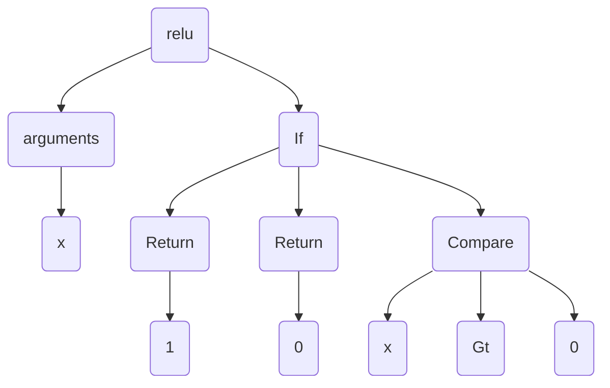

# astruc
A pretty `code2graph` parser for Python. The backbone is the Abstract Syntax Tree.


## Toy Example

Source code:

```python
def relu(x):
    if x > 0:
        return x
    else:
        return 0
```

Graph:




## Installation

```bash
pip install astruc
```


## Usage

**Quick start**

```python
from astruc import CodeStruc

source =\
"""def relu(x):
    if x > 0:
        return x
    else:
        return 0
"""
cs = CodeStruc(code)
# Obtain the AST.
tree = cs.walk()
# Obtain the adjacency matrix.
adj = cs.matrix()
```

